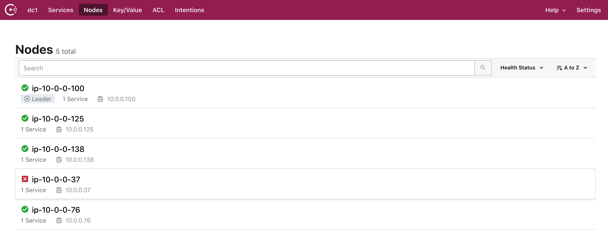
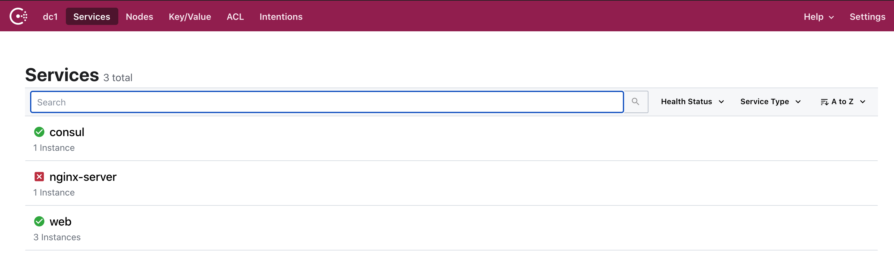
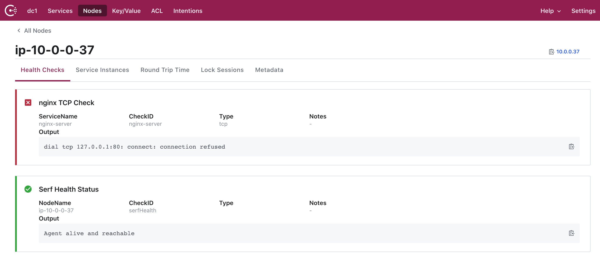

# Using Consul Template to Adjust Component Configuration Files

This repository is a derivation of the [F5 BIG-IP Consul SD webinar](https://github.com/hashicorp/f5-terraform-consul-sd-webinar), but instead of applying Consul's Service Discovery to the F5 AS3 interface, we utilize the `consul-template` function to automatically and dynamically adjust the configuration file for an NGINX load balancer.  Utilizing Consul with the `consul-template` in this fashion, a world of tickets and processes will float away, or at least be minimized (note, this statement has not been reviewed or approved by any legal entity).


# System Layout


With this layout, it is important to note that NGINX is being utilized in two different ways.  The NGINX Server is utilized as a Load Balancer to forward requests to the NGINX mock web server application running within the Auto Scaling Group.

# Prerequisites
In order to execute the demonstration, the following items are required:

- AWS Credentials (if using Environment Variables, this is AWS_ACCESS_KEY_ID and AWS_SECRET_ACCESS_KEY)
- Public IP address of your workstation, entered as a variable. This can be opened up/wildcarded, however, your security team might flip.
- Selected prefix to identify the resources created.

# Terraforming the Infrastructure
If desired the version of Consul can be adjusted by editing the `CONSUL_VERSION` variable within the `scripts/nginx.sh`, `scripts/nginx-server.sh` and `scripts/consul.sh` files.  These files download, install, and configure the specified Consul version within the Consul Server and the NGINX server and client nodes.

Once you clone or fork the repository, run `terraform init` from the 'terraform' directory.  This will pull down any modules and dependencies necessary.

Next, execute `terraform plan` to evaluate the resources created, and ensure that you have access setup properly.

And now, the moment we've all been waiting, for....`terraform apply -auto-approve`.  The `-auto-approve` flag automatically approvevs the apply phase...shocking, I know.

Once the system is all installed, Terraform will output some very important information.  This information won't lead you to the lost Templar treasure, but it will lead you to the treasure of automation.

```
Outputs:

Consul_Server_IP = 54.196.26.136
Consul_UI = http://54.196.26.136:8500
NGINX_LB_IP = 3.91.75.216
```

# Validating the Infrastructure
Let's use that information to validate our environment setup.

If you wish to use the Consul UI, you're going to need yet another tab in that lovely web browser of yours.  The Consul UI won't ask for credentials, so feel free to browse around; the sales associates won't bother you.  The important bits to observe are the Nodes and the Services listed.  These are the nodes and services that Consul is aware of.  You can see similar data using the CLI.


Note that there is only one Consul Server (Leader) in this configuration.  Don't do that in production...Consul should really have 5 nodes for redundancy in any "real world" scenario.



You will notice that there are three services registered with Consul, a "consul" service, an "nginx-server" service (the Load Balancer), and a "web" service (the web server function performed by nginx).  The Consul service is registered by default, and the "nginx-server" and "web" services were configured in Consul as part of the Terraform setup.  Specifically these were completed in the "scripts/nginx-server.sh" and "scripts/nginx.sh" scripts that Terraform applied.

 The nginx-server service doesn't look too happy, does it?  This is indicated on both the "Services" and "Nodes" views.  From the "Nodes" view, click on the unhealthy node...in the example above, the item is "ip-10-0-0-37".  This will give you a better idea of what the problem is.


From this screen, you can see the "Serf Health Status" is all good...this is the service that the Consul cluster utilizes to communicate.  The other service, "nginx TCP Check" isn't so happy.  We can see that the check is attempting to connect to port 80 on localhost (remember, this is localhost with respect to the Consul agent running on the NGINX Server node).

OK, so let's fix that Load Balancer, so we can start balancing loads.  Start by connecting to the NGINX Server node via SSH (wow, if only there was some product, called [Boundary](https://www.boundaryproject.io/), that would make this so much easier).  As part of the setup, we've created an SSH key for you in that same terraform folder...so from there you should be able to connect to the NGINX Server.
`ssh -i terraform....pem ubuntu@<NGINX_LB_IP>`

On this machine, there are a couple of things to check out.  As part of the Terraforming of this machine, I installed a binary called `consul-template` (more information available on the [consul-template Github project](https://github.com/hashicorp/consul-template)).  I've placed a configuration file on this machine which you can view with your cat (pending allergies):
`sudo cat /etc/consul-template.d/consul-template-config.hcl`

Within this configuration file, we have the Consul parameters so we know where to connect to, but more importantly, we have the parameters required for the templating.  This includes the source and destination files, permissions, and a command to run.  So that's our template file, a destination file, and then some stuff to do.  So let's look at that template file:
`sudo cat /etc/nginx/conf.d/load-balancer.conf.ctmpl`

The template looks a lot like a simple NGINX Load Balancer configuration file, with some other strange braces and stuff thrown in.  So what does this stuff mean?  Essentially, the consul-template looks for the service called 'web', and it's going to add the server address and port to the configuration file, as Consul recognizes a change.  The consul template can do a ton more than this, but honestly this is about the edge of my brain capacity.  Definitely check out the docs to see how the consul-template can help automate your own configurations.

If we look at the file that the template creates...
`sudo cat /etc/nginx/conf.d/load-balancer.conf`

That file doesn't exist yet!  It hasn't been created, because the `consul-template` service hasn't started yet.  We're going to start that service manually, but ideally this would be running as a background service (or better yet a [Nomad](https://nomadproject.io/) workload).

Before we start the consul-template service, though, open another window and start a simple cURL process to start hitting that NGINX Server.  Initially, that process will fail...that's OK for now...trust me.

So, within a seperate command shell window/tab, execute the following:
`watch "curl 34.229.181.104 | grep address"`

OK, now back on the NGINX server, let's run the consul-template.
`sudo consul-template -config=/etc/consul-template.d/consul-template-config.hcl &`

QUICK!  Look at your cURL command output.  Automatically, and quite quickly, the curl commands are starting to succeed.  If we look back a the Consul UI, we can see "nginx-server" service is now happy.

The Load blanacer config is quite basic as we've seen...just doing a round-robin among the servers in the Auto Scaling Group.

If you want to see how Consul updates the configuraiton dynamically, we have to change the number of servers in that Auto Scaling Group.  There are a couple of ways to do this...

First option (and in my opinion the easiest), is to alter the Terraform Code, specifically the nginx.tf file. Change the "desired_capacity" field within the "aws_autoscaling_group" resource. Feel free to increase or decrease that number, and execute the "terraform apply -auto-approve" command again. This will alter the number of nodes in that autoscaling group. After a few minutes, you should see the number of nodes in the Consul system, as well as the F5, change to match your configuration.

Another way to perform this is to utilize the AWS CLI or UI to terminate a node. This is a more abrupt approach, however, you can see the node go away, and the auto scaling group create a new one.

We've now been able to adjust the configuration file of an NGINX Load Balancer utilizing nothing more than Consul Service Discovery, and the "consul-template" function.  If you extend this thought process...just about any application driven by configuration files can pull in a level of network awareness.  Pretty cool!

This now ends your consuling session, I hope you feel better about yourself, and the world around you!